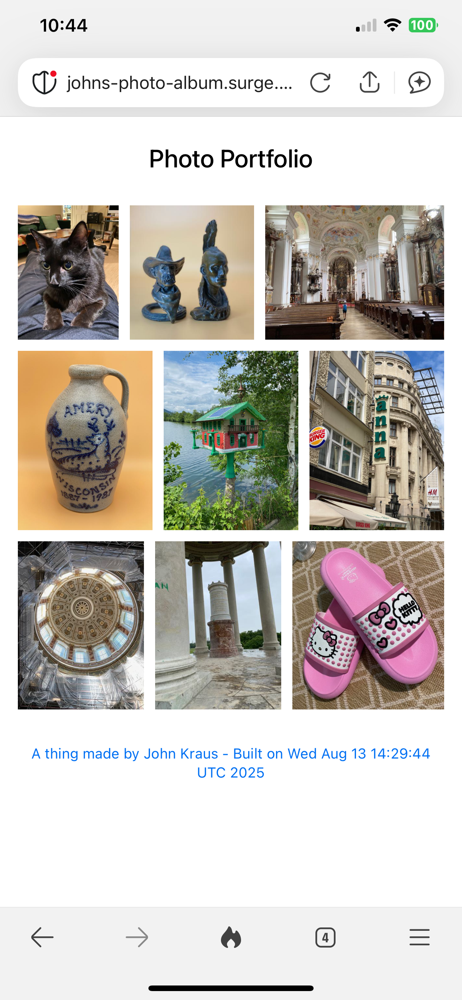
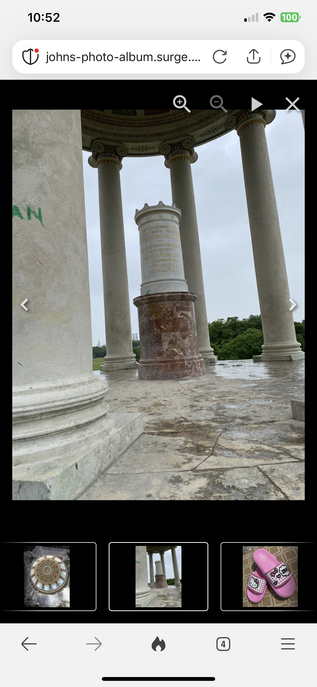

# react-lightbox-photo-album

<table>
<tr><td>

</td>
<td>

</td>
</tr>
</table>

The responsive live website is here: https://johns-photo-album.surge.sh/

The starting point for this website project was the lightbox example in this repository: https://github.com/igordanchenko/react-photo-album

Your photos for the photo album need to be uploaded to S3 or similar location.  Configure the S3 bucket URL and photo names in the src/photos.tsx file.

The application is deployed to Surge.sh.  A free Surge.sh account is required.  The photos are provided in an AWS S3 bucket.

Once you have a Surge.sh account, to get your SURGE_TOKEN, run:

surge token

Configure the SURGE_TOKEN and your unique SURGE_DOMAIN as GitHub secrets.

Commiting changes to the main branch updates the live website by triggering a GitHub Action configure in the `.github/workflows/deploy.yml` file.  

To run in development mode:

npm run dev

To deploy on Surge.sh:

Prerequisites:

- A Surge.sh account and domain (see Surge.sh for details).
- A GitHub.com repository for this project.

In your GitHub repository, under Settings > Secrets and variables > Repository secrets, configure the following Repository secrets:

SURGE_DOMAIN <br>
SURGE_TOKEN

Using the following commands, commit the code to the main branch in your GitHub repository to trigger the .github/workflows/deploy.yml script.
```shell
git add .
git commit -m 'your commit message'
git push
```
